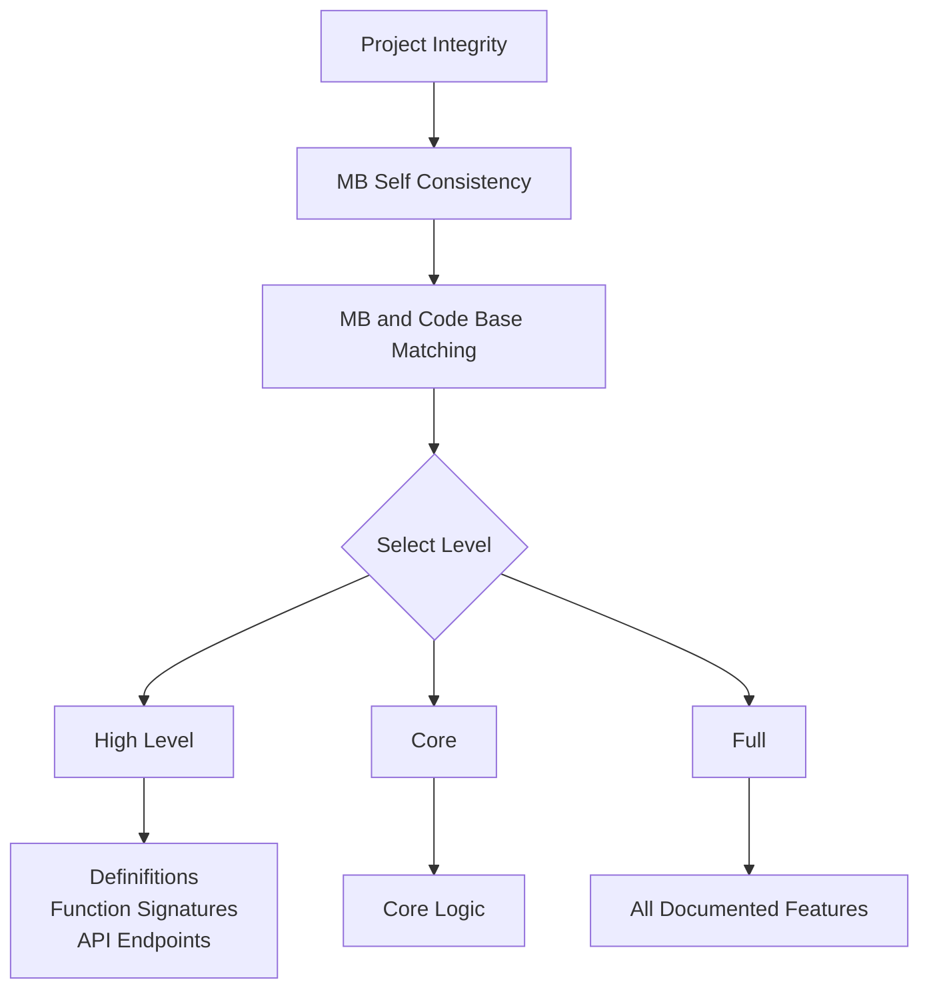

# Project Integrity Check
MB=memory-bank

To perform an integrity check of the project, follow this systematic process:

## 1. MB Self Consistency

- Check for contradictions between MB files
- Verify instructions are placed in correct MB files
- Identify duplicate information
- Find logic faults or inconsistencies
- Document any issues found

## 2. MB and Code Base Matching
Refer to the correct level check below while checking code against these MB files:

- systemPatterns.md: architecture, patterns, interfaces
- techContext.md: technical decisions, specifications
- activeContext.md: current work, recent changes
- progress.md: implementation status, pending tasks
- productContext.md: features, requirements
- projectbrief.md: core requirements

### High Level Check
Quick overview using `list_code_definition_names`
- Basic API structure
- Entry point identification
- Configuration review
- Interface overview
- Key function mapping

### Core Check
Perform the High Level Check then use `read_file` to review the code:
   - Core implementation review
   - Algorithm validation
   - Pattern verification

### Full Check
Perform the High Level Check then use:
1. `read_file`
   - All implementations
   - All algorithms
   - Complete pattern review

2. `search_files`
   - Feature validation
   - Dependency analysis
   - Pattern verification

## Common Issues

### MB Related
- Contradictions between files
- Misplaced instructions
- Duplicate information
- Logic inconsistencies

### Implementation Related
- API inconsistencies
- Missing features
- Pattern violations
- Incomplete documentation
- Configuration issues
- Integration gaps
